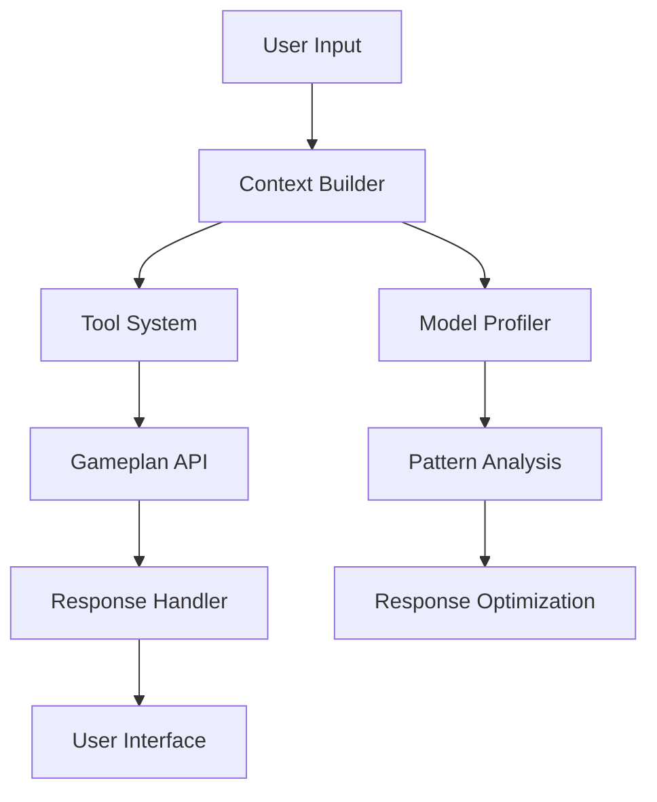
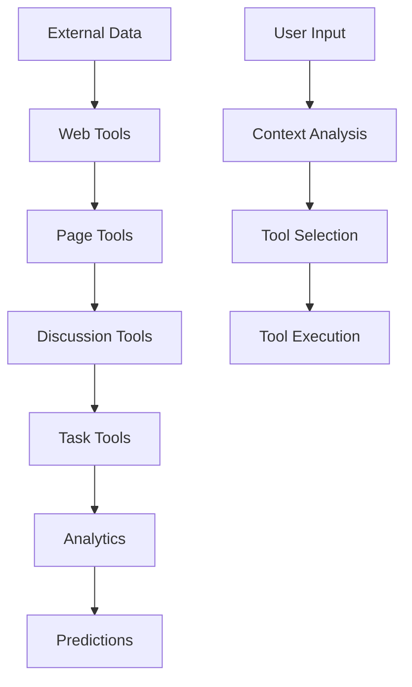

# Technical Documentation

## Current Implementation

### Core Components

1. **Context Management** (`context/`)
   - `base.py`: Base classes for context builders and formatters
   - `builder.py`: Implementation of context builders
   - `factory.py`: Factory for creating context builders and formatters
   - `formatter.py`: Implementation of context formatters

2. **Model Profiler** (`model_profiler/`)
   - Response pattern analysis
   - Hypothesis testing framework
   - Usage pattern detection
   - Performance metrics collection
   - Credit usage optimization
   - Rate limiting management

3. **API Layer** (`gameplan_api.py`)
   - Manages Gameplan integration
   - Handles API requests
   - Processes responses
   - Maintains API state

4. **Tool System** (`tools/tools_caller.py`)
   - Task Management Tools
   - Page Management Tools
   - Discussion Tools
   - Web Tools

### System Design

## Implementation Details

### Context Builder
- Manages conversation state
- Processes user input
- Maintains context history
- Handles tool selection

### Model Profiler
- Tests hypotheses about tool usage
- Analyzes response patterns
- Optimizes model performance
- Manages API usage and limits
- Collects usage statistics
- Generates performance reports

### API Integration
- Gameplan API communication
- Response processing
- Error handling
- State management

### Tool System

#### Task Analysis Tools (`tools/tasks/`)
- **Task Information**
  - Get task details
  - List and filter tasks
  - View task history
  - Track task updates

- **Estimation Analysis**
  - Quality analysis (`analyze_estimate_quality.py`)
  - Trend detection (`analyze_estimate_trends.py`)
  - Change prediction (`predict_estimate_changes.py`)
  - Historical tracking (`get_task_estimate_history.py`)

- **Team Analytics**
  - Workload analysis (`analyze_team_workload.py`)
  - Team estimation metrics (`get_team_estimation_metrics.py`)
  - Performance tracking
  - Capacity insights

- **Project Analysis**
  - Critical path visualization (`analyze_critical_path.py`)
  - Dependency insights (`get_task_dependencies.py`)
  - Completion predictions (`predict_completion_dates.py`)
  - Similar task identification (`find_similar_tasks.py`)

#### Page Management Tools (`tools/pages/`)
- **Content Operations**
  - Page creation (`create_page.py`)
  - Page updates (`update_page.py`)
  - Content retrieval (`get_page_content.py`)
  - Page listing (`list_pages.py`)

#### Discussion Tools (`tools/discussion/`)
- **Communication Management**
  - Comment retrieval (`get_comments.py`)
  - Discussion tracking
  - Thread organization
  - Conversation context

#### Web Tools (`tools/web/`)
- **Web Integration**
  - Web search capabilities (`web_search.py`)
  - Webpage content extraction (`get_webpage_content.py`)
  - External data integration
  - Resource analysis

### Tool Interactions

#### Data Flow Between Tools

#### Cross-Tool Features
- Content linking between pages and tasks
- Discussion context for task updates
- Web content integration with pages
- Task references in discussions
- Analytics across all tool data

#### Tool Selection Logic
- Context-based tool selection
- Multi-tool operation sequences
- Tool chain optimization
- Result aggregation

## Current APIs

### Core APIs
- Task Management API
- Page Management API
- Discussion API
- Web Tools API

### Analysis APIs
- Pattern Recognition API
- Profiling API
- Hypothesis Testing API
- Performance Metrics API

## Planned Extensions

### Cognitive Analysis System
- Mood detection
- Bias analysis
- Decision support
- Team dynamics

### Advanced Analytics
- Project metrics
- Team performance
- Predictive analysis
- Risk assessment

### Enhanced Collaboration
- Meeting management
- Action item tracking
- Smart notifications
- Sentiment analysis

## Current Architecture

### Components
- Preprocessors for input handling
- Processors for task execution
- Scheduler for job management
- Tool system for operations

### Data Flow
- User input processing
- Context building
- Tool selection
- API interaction
- Response generation

## Security

- Authentication with Frappe
- API security
- Data protection
- Access control

## Testing

- Unit tests
- Integration tests
- API tests
- Tool system tests

## Deployment

- Frappe bench deployment
- Configuration management
- Environment setup
- Monitoring setup 

### Core Principles

#### Task Management Philosophy
- Tasks are created and managed by humans
- Agent provides analysis and insights
- No automated task creation
- Focus on supporting human decisions

#### Analysis Capabilities
- Historical data analysis
- Pattern recognition
- Trend identification
- Performance metrics
- Resource utilization
- Team workload assessment

#### Support Functions
- Decision support
- Insight generation
- Risk identification
- Pattern detection
- Timeline analysis 

### Context Analysis

#### Team-Wide Context
- Cross-project pattern recognition
- Team-level performance analysis
- Resource utilization across projects
- Historical trend analysis
- Knowledge sharing between projects

#### Context Levels
1. **Task Level**
   - Individual task details
   - Task history and updates
   - Direct dependencies

2. **Project Level**
   - Project-specific patterns
   - Team composition
   - Project timelines
   - Resource allocation

3. **Team Level**
   - Cross-project insights
   - Team-wide patterns
   - Resource sharing
   - Knowledge transfer

4. **Organization Level**
   - Best practices
   - Common patterns
   - Resource optimization
   - Strategic insights

### Analysis Capabilities

#### Cross-Project Analysis
- Pattern detection across projects
- Resource utilization optimization
- Knowledge sharing opportunities
- Best practices identification
- Team performance correlation
- Timeline optimization insights

#### Team-Wide Metrics
- Workload distribution
- Expertise mapping
- Resource availability
- Performance patterns
- Collaboration effectiveness
- Knowledge sharing efficiency 